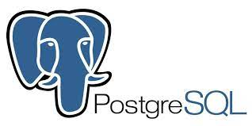

# Postgresql with Python 

## This folder contains chapters of Postgresql with python lecture notes for the Data Smart Science course: Database and SQL. The Postgresql codes will be applied to solving real world data wrangling problems. The descriptions of the individual chapters will be added to this document as new chapters are added to the folder: 

### Chapter 1: Postgresql set-up in python   

In this chapter we will show the steps involved in connecting a Postgresql to python. In this way we will able to process the Postgresql databases using python; it will also make it possible to integrate python's popular data wrangling packages, such as Pandas, with sql. The name of the jupyter notebook for this chapter is postgresql_python_connection. We will also show how to use the sql magic in the jupyter notebook.   

### Chapter 2: Data types

Here we will explore the fundamental information or atomic information that are used to create variables in the tables of a database.   

### Chapter 3: Creating Tables & Inserting Values   

Following from chapter 2, we will create a table and define the columns in the table with data types. We will also insert values in the table columns.

